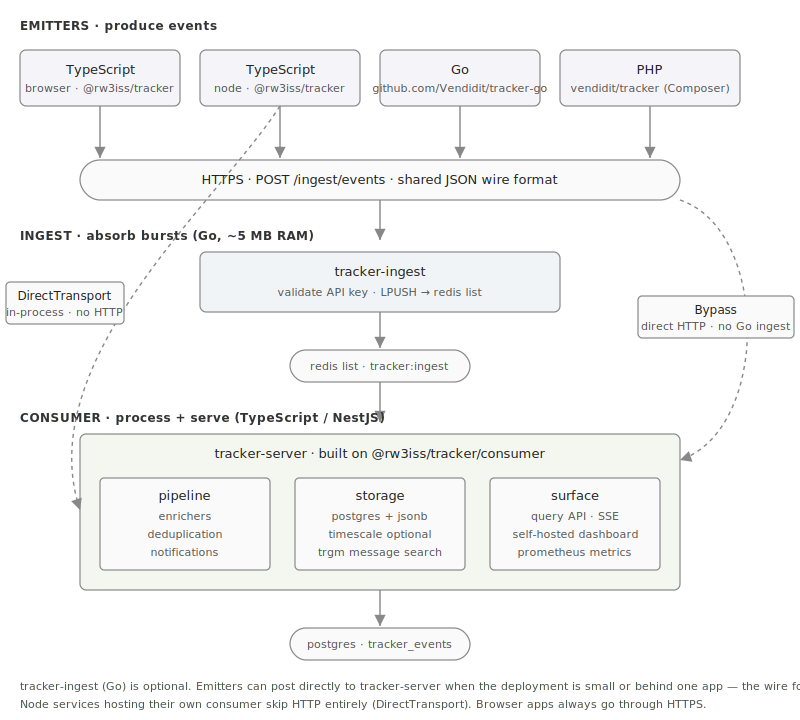
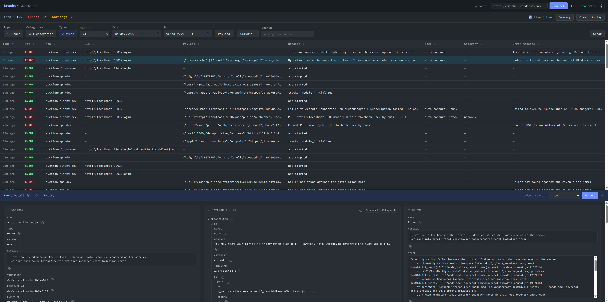

# @rw3iss/tracker

<!-- Static badge: this repo is private, so shields.io's auto-fetch
     endpoint can't read its release list. Update the version segment
     below at each `git tag` + `gh release create`. -->
[](https://github.com/rw3iss/tracker/releases)

Self-hosted event and error tracking. Polyglot emitters in **TypeScript, Go, and PHP** post either to an optional [Go ingest server](https://github.com/rw3iss/tracker-ingest) (recommended for higher throughput / burst absorption) or **directly** to the consumer for simpler single-app deployments. The consumer is a **TypeScript NestJS engine** that ships in this package — store, query, and serve a self-hosted dashboard without writing any Go-side processing code.

<p align="center">
  
</p>

`tracker-server` ships with an optional self-hosted **dashboard** for browsing, filtering, and triaging events — enabled by default and configurable via `DASHBOARD_PATH` / `DASHBOARD_ENABLED` env vars (mount it at the host root, under a sub-path, or turn it off entirely).

<p align="center">
  
</p>

## Documentation

| Link | What it covers |
|---|---|
| **[Docs](https://tracker.ryanweiss.net/docs/)** | Guided tour: architecture, deployment, SDKs, operations. Start here. |
| **[API Contract](https://tracker.ryanweiss.net/docs/api/contract/)** | Language-agnostic JSON wire format every emitter speaks. |
| **[SDK Guide](https://tracker.ryanweiss.net/docs/sdk/typescript/)** | TypeScript emitter API; Go and PHP guides linked from the same index. |
| **[Config](https://tracker.ryanweiss.net/docs/operations/config/)** | Env vars, deduplication, storage, multi-tenant setup. |

---

## Polyglot — three SDK languages, one wire format

| Language | Package | Where it lives |
|---|---|---|
| TypeScript / JavaScript | `@rw3iss/tracker` *(this package)* | browsers · Node · NestJS |
| Go | `github.com/rw3iss/tracker-go` | services that need a stdlib-only emitter |
| PHP | `rw3iss/tracker` (Composer) | Laravel and vanilla PHP backends |

All three SDKs serialize the same `TrackerEvent` JSON. Errors arrive with a uniform `{ name, message, stack?, file?, line?, code?, previous? }` shape regardless of source language — see the [API Contract](https://tracker.ryanweiss.net/docs/api/contract/).

---

## Subpackages

This package splits along the producer/receiver line. **Most apps only use the emitter half.** Each subpath is tree-shaken — importing `@rw3iss/tracker` doesn't pull in any consumer code, and vice versa.

### Emitter side — apps that **produce** events

```
   tracker.error(err)  →  enrichers  →  plugins  →  beforeSend  →  transport (HTTP / Direct)
```

| Subpath / package | Role |
|---|---|
| `@rw3iss/tracker` *(default)* | `TrackerClient`, `tracker` singleton — the capture API for browser + Node TypeScript apps |
| `@rw3iss/tracker/emitter` | Explicit alias for the default |
| `@rw3iss/tracker/breadcrumbs` | Rolling activity buffer (clicks · navigation · console · network) attached to errors |
| `@rw3iss/tracker/sw` | Service-Worker Background Sync — survive flaky networks and tab closes |
| `@rw3iss/tracker/analytics` | GA-style auto-emit vocab: page views, sessions, scroll, form fields, ecommerce |
| `@rw3iss/tracker/ga` | Google Analytics 4 integration (gtag.js / GTM) |
| `@rw3iss/tracker/types` | Shared TS types only — no runtime |
| [`rw3iss/tracker-go`](https://github.com/rw3iss/tracker-go) | Go emitter — same wire format, stdlib-only |
| [`rw3iss/tracker-php`](https://github.com/rw3iss/tracker-php) | PHP emitter (Composer · Laravel auto-discovery) — same wire format |

### Consumer side — services that **receive** events

```
   ingest  →  onIngest  →  dedup  →  enrichers  →  onEvent  →  storage / notify / forward
```

Two ways to receive events: a **Go ingest server** in front for high-throughput public endpoints, or **directly** into the NestJS consumer (HTTP or in-process). Pick whichever fits your topology — both are wire-compatible.

| Subpath / package | Role |
|---|---|
| `@rw3iss/tracker/consumer` | NestJS `TrackerModule`, `TrackerService`, `DirectTransport` — the processing engine |
| `@rw3iss/tracker/storage` | `EventStoragePlugin` + storage adapters + query helpers (Postgres, in-memory, SQS) |
| `@rw3iss/tracker/notifications` | Multi-channel alerts: email · Slack · Discord · SMS · webhook · Firebase |
| `@rw3iss/tracker/ga/server` | Server-side Google Analytics via Measurement Protocol |
| [`rw3iss/tracker-ingest`](https://github.com/rw3iss/tracker-ingest) | Separate Go ingestion server — validates API keys + LPUSH to Redis ahead of the consumer (~5 MB RAM, absorbs bursts) |

---

<details open>
<summary><h1>Emitter — apps that produce events</h1></summary>

Use this side in any app you're instrumenting (browser, Node service, NestJS app, etc.). One singleton, one config, one universal API.

> **Non-TypeScript services** use their own emitter package — same endpoint, same JSON shape. See [`rw3iss/tracker-go`](https://github.com/rw3iss/tracker-go) (Go, stdlib-only) and [`rw3iss/tracker-php`](https://github.com/rw3iss/tracker-php) (PHP, Composer / Laravel auto-discovery).

## Install

```bash
npm install @rw3iss/tracker
```

## Quickstart

```typescript
import { TrackerClient, tracker } from '@rw3iss/tracker';

TrackerClient.init({
  endpoint: 'https://tracker.example.com/ingest/events',
  appId:    'my-app',
});

tracker.error(new Error('payment failed'));
tracker.warn('deprecated API call', { fn: 'getUser' });
tracker.info('user signed in');
tracker.debug('state mismatch', { expected: 5, got: 3 });
tracker.event('page_view', { page: '/auctions' });
tracker.track('auction:stale-state', { auctionId: 123 }); // category auto-extracted from prefix
```

`autoCapture` (default `true`) installs `window.onerror` + `window.onunhandledrejection` in the browser, and `process.on('uncaughtException')` + `process.on('unhandledRejection')` in Node — so unhandled errors are reported automatically without further code.

## Capture methods

```typescript
import { tracker } from '@rw3iss/tracker';

// Severity-named convenience methods
tracker.error(new Error('msg'), { tags: ['checkout'] });
tracker.warn('deprecated API', { fn: 'getUser' });
tracker.info('user signed in');
tracker.debug('state mismatch', { expected: 5, got: 3 });

// Custom analytics events (always captured regardless of minLevel)
tracker.event('order.completed', { orderId: '123' });

// Domain shorthand — category auto-extracted from "prefix:name"
tracker.track('auction:stale-state', { auctionId: 123 });
tracker.track('order:failed', { orderId: 1 }, 'error');   // override type

// Full control
tracker.capture({ type: 'error', message: '...', payload: {}, tags: [] });
```

### Context

```typescript
tracker.setContext({ userId: 'u-123' });   // merged into every subsequent event
tracker.clearContext();
tracker.setSessionId('new-session-id');
```

### Lifecycle

You generally **don't** need to call `flush()` or `destroy()`. The HTTP queue auto-flushes on a timer (default every 5s), on `pagehide` / `beforeunload` in the browser, and at queue-size thresholds. Call them only in these cases:

| Method | When to call |
|---|---|
| `await tracker.flush()` | Force immediate delivery — e.g. right before navigating away from a critical flow when you can't wait for the next interval, or in tests. Idempotent and safe to skip. |
| `await tracker.destroy()` | Clean shutdown before the runtime exits — Node services on `SIGTERM`/`SIGINT`, NestJS `OnApplicationShutdown`, programmatic teardown. Drains the queue, removes auto-capture listeners, then disables the singleton. The browser's unload hook covers this automatically; don't bother in browser apps unless you explicitly tear down a tracker yourself. |

```typescript
await tracker.flush();        // optional — drain queue immediately
await tracker.destroy();      // on process shutdown — flushes, then tears down

tracker.isEnabled;            // boolean
tracker.getConfig();          // readonly config
```

## Configuration — `TrackerConfig`

Either `endpoint` or `transport` is required. Everything else is optional.

```typescript
interface TrackerConfig {
  // ── Delivery (pick one) ──────────────────────────────────────────────
  endpoint?:     string;             // POST URL for HTTP delivery
  transport?:    ITrackerTransport;  // Custom transport (e.g. DirectTransport)

  // ── Authentication ────────────────────────────────────────────────────
  apiKey?:       string;             // Sent as X-Tracker-Key header (optional)

  // ── Identity ─────────────────────────────────────────────────────────
  appId?:        string;             // Stamped on every event
  environment?:  'development' | 'staging' | 'production';
  appVersion?:   string;

  // ── Filtering ────────────────────────────────────────────────────────
  enabled?:      boolean;            // Master switch; default: true
  minLevel?:     EventType;          // Minimum severity; default: capture all
  beforeSend?:   BeforeSendFn;       // Return null to drop; runs after plugins

  // ── Behavior ─────────────────────────────────────────────────────────
  autoCapture?:  boolean;            // window.onerror / process.on; default: true
  debug?:        boolean;            // Log internal activity; default: false
  globalName?:   string;             // Expose on globalThis (e.g. 'tracker')
  networkCapture?: boolean | NetworkCaptureConfig;  // Capture failed fetch/XHR (response body included by default)

  // ── Enrichment (see "Enrichment architecture" below) ─────────────────
  contextEnrichment?: ContextEnrichmentMode;  // browser-host context fields; default: true (standard set)
  errorEnrichment?:   ErrorEnrichmentMode;    // SerializedError optional fields; default: true (full)

  // ── Pipeline ─────────────────────────────────────────────────────────
  enrichers?:    EnricherFn[];
  plugins?:      ITrackerClientPlugin[];

  // ── HTTP-mode options (ignored when transport is set) ────────────────
  queue?:        { maxSize?: number; flushInterval?: number; storageKey?: string };
  retry?:        { maxAttempts?: number; baseDelay?: number; backoffFactor?: number };
  sessionTracking?: boolean | { hooks?: SessionLifecycleHooks; sessionId?: string };
  rateLimit?:    RateLimitConfig;
  crossTabCoordination?: boolean;
  serviceWorkerTransport?: ServiceWorkerTransportConfig;
}
```

## Enrichment architecture

The tracker enriches events at three distinct layers. Each one has a separate config because they run in different parts of the pipeline:

```
   tracker.error(err) / tracker.event(...) / etc.
                       │
   ┌───────────────────┼─────────────────────────────────────┐
   │                   │                                     │
   │  Layer 1: contextEnrichment (browser-host fields)       │
   │    window/navigator/document/screen → TrackerContext    │
   │    ─ url, path, userAgent, language, timezone,          │
   │      viewport, screen, referrer, connection             │
   │    ─ Browser-only; Node no-op                           │
   │                   │                                     │
   │  Layer 2: errorEnrichment (SerializedError shape)       │
   │    Only runs on tracker.error(err)                      │
   │    ─ name, message, stack (always)                      │
   │    ─ file, line, code, previous (configurable)          │
   │    ─ Cross-SDK: TS, Go, PHP all share the wire shape    │
   │                   │                                     │
   │  Layer 3: enrichers + plugins (custom / heavyweight)    │
   │    User-defined functions and plugins. This is where    │
   │    GeoIP, SourceMap, UserAgent parsing live (server-    │
   │    side, in @rw3iss/tracker/consumer).                │
   │                   │                                     │
   └───────────────────┼─────────────────────────────────────┘
                       ▼
                   beforeSend → transport
```

### Layer 1 — `contextEnrichment`

Stamps host-environment fields onto `TrackerContext`. Cheap; runs on every event.

```typescript
contextEnrichment: true                // standard set (default)
contextEnrichment: false               // off
contextEnrichment: 'full'              // everything
contextEnrichment: 'minimal'           // url + path only
contextEnrichment: { userAgent: false } // standard set minus userAgent
contextEnrichment: { referrer: true }   // standard set plus referrer (which isn't standard)
```

| Field | `true` (standard) | `'full'` | `'minimal'` |
|---|:-:|:-:|:-:|
| url | ✓ | ✓ | ✓ |
| path | ✓ | ✓ | ✓ |
| userAgent | ✓ | ✓ | |
| language | ✓ | ✓ | |
| timezone | ✓ | ✓ | |
| viewport | ✓ | ✓ | |
| referrer | | ✓ | |
| screen | | ✓ | |
| connection | | ✓ | |

Object form layers per-field overrides on top of the **standard set**, not on top of "everything" — opt into non-standard fields explicitly.

### Layer 2 — `errorEnrichment`

Controls the optional fields on `SerializedError`. `name` / `message` / `stack` are always emitted; everything else is configurable.

```typescript
errorEnrichment: true                  // full (default) — every optional field
errorEnrichment: false                 // minimal — name/message/stack only
errorEnrichment: 'full'                // synonym for true
errorEnrichment: 'minimal'             // synonym for false
errorEnrichment: { previous: false }   // full minus the cause chain
errorEnrichment: { file: true, line: true, code: false, previous: false }
```

| Field | `true` / `'full'` | `false` / `'minimal'` |
|---|:-:|:-:|
| name | ✓ | ✓ |
| message | ✓ | ✓ |
| stack | ✓ | ✓ |
| file | ✓ | |
| line | ✓ | |
| code | ✓ | |
| previous[] | ✓ | |

This shape mirrors the Go and PHP SDKs — see [API contract](https://tracker.ryanweiss.net/docs/api/contract/).

**Why it matters — payload + storage savings.** `errorEnrichment` is primarily a **payload-size knob**. On a representative HTTP-handler error with a 3-deep `Error.cause` chain and a 9-line stack trace, switching from `'full'` to `'minimal'` cuts the per-event JSON from **1,454 → 793 bytes — a ~45% reduction** that compounds over wire bytes, ingest queue depth, and Postgres row size for every error stored. At 10K errors/sec that's ~6.3 MB/s less network traffic and proportional database growth slowed.

The benchmark + an equivalent CPU measurement (~20× faster in minimal mode, but still small in absolute terms) lives at [`benchmarks/`](./benchmarks/) — run with `pnpm bench`. Numbers and methodology in [`benchmarks/README.md`](./benchmarks/README.md). Sibling Go and PHP SDK benchmarks in their respective repos.

### Layer 3 — `enrichers` and plugins

Use this for anything richer than per-field flags: custom data, asynchronous lookups, plugin-provided enrichment.

```typescript
TrackerClient.init({
  endpoint: '...',
  enrichers: [
    (event) => ({ ...event, payload: { ...event.payload, build: GIT_SHA } }),
  ],
  plugins: [new BreadcrumbsPlugin()],
});
```

Heavy server-side enrichment — GeoIP from request IP, source-map resolution, UserAgent parsing — lives in `@rw3iss/tracker/consumer` plugins, not in this layer. Keep capture-time cheap.

## Event types and severity

`'error' | 'warning' | 'info' | 'debug' | 'event'`

Severity ordering: `error > warning > info > debug > event`

- `error` — exceptions, failed operations
- `warning` — degraded state, recoverable issues
- `info` — significant operations
- `debug` — diagnostic state (suppressed in production via `minLevel: 'info'`)
- `event` — custom analytics (always captured regardless of `minLevel`)

## Browser vs Node behavior

The emitter is universal. Browser-only features degrade silently in Node:

| Feature | Browser | Node |
|---|---|---|
| `autoCapture` | `window.onerror` + `unhandledrejection` | `process.on('uncaughtException')` + `unhandledRejection` |
| `networkCapture` | Captures failed `fetch` / `XHR` (with response body) | No-op |
| Queue / retry / flush | ✓ | ✓ |
| `localStorage` persistence | ✓ | Disabled |
| `sendBeacon` on unload | ✓ | Disabled |
| `crossTabCoordination` | ✓ | Disabled |
| `serviceWorkerTransport` | ✓ | Disabled |

### Network capture — failed-request events

When `networkCapture` is on (either `true` or any `NetworkCaptureConfig` object), the SDK monkey-patches `window.fetch` and `XMLHttpRequest.prototype.send/open` and emits a tracker event for every failed request (status `0` or `>= 400`). For each failed request the response body is read and attached so the dashboard shows what actually went wrong, not just the status code.

```typescript
TrackerClient.init({
  endpoint: 'https://tracker.example.com/ingest/events',
  appId:    'buyer-portal',
  networkCapture: {
    captureFetch: true,        // default
    captureXhr:   true,        // default
    errorsOnly:   true,        // default — false to log every request
    ignoreUrls:   [/\/heartbeat/, 'crisp.chat'],
    body: {
      enabled:       true,     // default — false to keep status-only
      maxBytes:      8192,     // default — body text truncated past this
      readTimeoutMs: 1500,     // default — abandoned read past this
    },
  },
});
```

What lands on the event for `POST /bids/placeBid` returning `400 { "message": "Bid below $1020" }`:

```json
{
  "type": "error",
  "message": "POST /bids/placeBid — 400: Bid below $1020",
  "category": "network",
  "payload": {
    "method": "POST",
    "url":    "/bids/placeBid",
    "status": 400,
    "body":   { "message": "Bid below $1020" },
    "bodyTruncated": false
  },
  "error": { "name": "HttpError400", "message": "Bid below $1020" },
  "tags": ["auto-capture", "network"]
}
```

How body capture works:
- **Fetch.** `res.clone()` so the original response stays untouched for the calling code, then a streaming `getReader()` pulls bytes until either the byte cap or the read timeout is hit. Stuck/streaming responses are abandoned with a `bodyTruncated: true` marker — never block user code.
- **XHR.** Body is already buffered at `loadend`; read `responseText` (skipped silently if `responseType !== 'text' | ''`) and apply the same byte cap.
- **Best-effort JSON parse.** Bodies that parse as JSON land as objects in `payload.body`; the rest stay as strings. Either way the dashboard renders structured payloads correctly.
- **`error` field synthesis.** `name` is `HttpError<status>`; `message` comes from `body.message → body.error.message → body.error → first 240 chars of raw text`. `event.error` is no longer `null` for HTTP failures.
- **PII.** `beforeSend` runs after this — return a redacted copy or `null` for endpoints whose error responses can leak sensitive data.

Network breadcrumbs (the `BreadcrumbsPlugin` `network` collector) capture failed-request bodies too, with smaller defaults — `maxBytes: 2048`, `readTimeoutMs: 1000` — since breadcrumbs piggyback on other events. Configure via `breadcrumbs.network.body` with the same `{ enabled, maxBytes, readTimeoutMs }` shape.

<details>
<summary><strong>Session tracking and rate limiting</strong></summary>

```typescript
TrackerClient.init({
  endpoint: '...',
  appId:    'my-app',
  sessionTracking: true,
  rateLimit: {
    error:   { capacity: 20, refillPerSec: 2 },
    warning: { capacity: 50, refillPerSec: 10 },
    summaryIntervalMs: 30_000,
  },
});

tracker.setSessionId('auth-session-id-from-backend');
```

Session IDs are auto-generated; pass an external one (e.g. from your auth backend) to correlate with server-side traces.

</details>

<details>
<summary><strong>Enrichers</strong></summary>

Enrichers run in order before events enter the queue. Sync or async:

```typescript
TrackerClient.init({
  endpoint: '...',
  enrichers: [
    (event) => ({ ...event, tags: [...(event.tags ?? []), 'app-shell'] }),
    async (event) => ({ ...event, payload: { ...event.payload, buildId: await getBuildId() } }),
  ],
});
```

</details>

<details>
<summary><strong>Custom emitter plugins</strong></summary>

```typescript
interface ITrackerClientPlugin {
  onInit(client: ITrackerClientRef): void | Promise<void>;
  onCapture?(event: TrackerEvent): TrackerEvent;
  onDestroy?(): void;
}
```

Pipeline order: enrichers → `onCapture` (in declaration order) → `beforeSend` → delivery.

```typescript
class AppVersionPlugin implements ITrackerClientPlugin {
  constructor(private readonly version: string) {}
  onInit() {}
  onCapture(event: TrackerEvent): TrackerEvent {
    return { ...event, payload: { ...event.payload, appVersion: this.version } };
  }
}

TrackerClient.init({ endpoint: '...', plugins: [new AppVersionPlugin('1.2.3')] });
```

</details>

<details>
<summary><strong>Custom transports</strong></summary>

```typescript
interface ITrackerTransport {
  send(events: TrackerEvent[]): Promise<void>;
  start?(): void;
  stop?(): void;
  flush?(): Promise<void>;
}
```

Provide `endpoint` for built-in HTTP queue+flush, or `transport` for custom delivery. The capture pipeline (enrichers, plugins, `beforeSend`, rate limiting) runs identically regardless.

| Transport | When to use |
|---|---|
| HTTP *(implicit when `endpoint` is set)* | Browser clients, remote Node services |
| `DirectTransport` *(from `/consumer`)* | A backend tracking *itself* into its own `TrackerService` — see Consumer section |

</details>

## Emitter subpackages

<details open>
<summary><h3><code>/breadcrumbs</code> — rolling activity buffer</h3></summary>

Auto-collected trail of recent actions (navigation, clicks, console output, network) attached to errors as `payload.breadcrumbs`.

```typescript
import { TrackerClient } from '@rw3iss/tracker';
import { BreadcrumbsPlugin } from '@rw3iss/tracker/breadcrumbs';

TrackerClient.init({
  endpoint: '...',
  plugins: [
    new BreadcrumbsPlugin({
      attachTo:         ['error'],
      clearAfterAttach: true,
    }),
  ],
});
```

<details>
<summary><strong>Full configuration + custom collectors</strong></summary>

```typescript
new BreadcrumbsPlugin({
  maxItems:         50,
  attachTo:         ['error'],
  clearAfterAttach: true,
  navigation: true,
  click:      true,
  console:    { levels: ['error'] },
  network:    { ignoreUrls: [/\/tracker\//] },
});
```

Built-in collectors: `NavigationCollector`, `ClickCollector`, `ConsoleCollector`, `NetworkCollector`. Custom collectors implement `ICollector`.

</details>

</details>

<details open>
<summary><h3><code>/analytics</code> — auto-emitted GA-style analytics vocab</h3></summary>

Opt-in plugin that auto-emits `page_view`, `session_start`/`session_end`, `scroll`, `click_outbound`, `file_download`, `form_start`/`form_submit`, `view_search_results`, `user_engagement`, and `first_visit` — covering the same ground as GA4's enhanced measurement, but flowing through the tracker pipeline.

```typescript
import { TrackerClient } from '@rw3iss/tracker';
import { AnalyticsPlugin } from '@rw3iss/tracker/analytics';

TrackerClient.init({
  endpoint: 'https://tracker.example.com/ingest/events',
  appId:    'buyer-portal',
  plugins:  [new AnalyticsPlugin()],
});
```

Default config matches GA4's enhanced-measurement set. Toggle individual collectors, configure session inactivity, set the visitor storage backend (localStorage / cookie / sessionStorage / memory), gate everything on consent, sample at the edge with `alwaysEmit` exceptions for high-value events. Full reference: [`src/analytics/README.md`](./src/analytics/README.md).

Type-safe ecommerce helpers ship alongside:

```typescript
import { ecommerce } from '@rw3iss/tracker/analytics';
ecommerce.purchase({ transaction_id: 'ord-99', value: 1200, currency: 'USD', items: [...] });
```

For the consumer side, `AnalyticsQueryHelpers` (in `/storage`) answers the same questions GA4 dashboards do — DAU/MAU, top pages, traffic sources, funnel drop-off, cohort retention, last-touch attribution.

</details>

<details open>
<summary><h3><code>/ga</code> — Google Analytics 4 integration</h3></summary>

Three modes, multi-ID support, typed `gtag` wrapper, GA Consent Mode v2 wiring, GTM adapter, batched forward queue. Full reference: [`src/ga/README.md`](./src/ga/README.md).

```typescript
import { TrackerClient } from '@rw3iss/tracker';
import { GoogleAnalyticsPlugin, gaPresets } from '@rw3iss/tracker/ga';

TrackerClient.init({
  endpoint: 'https://tracker.example.com/ingest/events',
  plugins: [
    new GoogleAnalyticsPlugin({
      measurementIds: ['G-XXXXXXXX'],
      mode:           'ga-only',
      ...gaPresets.privacyFirst,
    }),
  ],
});
```

| Mode | When |
|---|---|
| `'ga-only'` | GA is the only analytics; one-line setup |
| `'tandem'` | Run AnalyticsPlugin + GA together with shared visitor/session IDs |
| `'forward'` | AnalyticsPlugin is canonical; events forwarded to GA via batched `gtag('event', ...)` |

For server-originating events (webhooks, conversions resolved post-redirect), pair with the companion server plugin under [`@rw3iss/tracker/ga/server`](./src/ga/README.md#server-side--rw3isstrackergaserver) which uses the GA4 Measurement Protocol.

</details>

<details open>
<summary><h3><code>/sw</code> — Service-Worker delivery</h3></summary>

Ensure events deliver even after the page closes. Activates a shared IndexedDB queue.

```typescript
// Standalone SW (zero-config):
TrackerClient.init({
  endpoint: '...',
  serviceWorkerTransport: { swUrl: '/tracker-sw.js' },
});

// Or integrate into your existing SW:
import { setupTrackerSync } from '@rw3iss/tracker/sw';
setupTrackerSync();
```

<details>
<summary><strong>Cross-tab coordination</strong></summary>

Leader election via `BroadcastChannel` — only one tab flushes at a time, avoiding duplicate POSTs from a multi-tab app.

```typescript
TrackerClient.init({
  endpoint: '...',
  crossTabCoordination: true,
  serviceWorkerTransport: { swUrl: '/tracker-sw.js' },
});
```

Both features automatically activate the shared IndexedDB queue.

</details>

</details>

</details>

---

<details open>
<summary><h1>Shared — <code>@rw3iss/tracker/types</code></h1></summary>

Common types and a couple of small runtime helpers. For libraries that depend on the event format without pulling in the emitter — and for downstream code (dashboards, analyzers, custom consumers) that needs to typecheck against the wire format.

```typescript
import type {
  TrackerEvent,
  StoredTrackerEvent,
  TrackerContext,
  SerializedError,
  EventType,
  EnricherFn,
  Breadcrumb,
  BreadcrumbCategory,
  BreadcrumbLevel,
  EventFilter,
  EventFilterFn,
  EventFilterConfig,
} from '@rw3iss/tracker/types';

// Runtime helpers exported from the same subpath
import {
  TrackerEventStatus,
  EVENT_SEVERITY,
  matchesEventFilter,
} from '@rw3iss/tracker/types';
```

> **All timestamps are Unix milliseconds.** Not seconds.

### Event shape

<details>
<summary><strong><code>TrackerEvent</code></strong> — wire format produced by the emitter</summary>

```typescript
interface TrackerEvent {
  /** Event severity/category. */
  type:      EventType;
  /** Human-readable description of what happened. */
  message:   string;
  /** Unix ms, set by the emitter at capture time. */
  timestamp: number;
  /** App/service identifier — set at init, auto-stamped on every event. */
  appId?:    string;
  /** Arbitrary structured data. */
  payload?:  Record<string, unknown>;
  /** Serialized error details, present when `type` is `'error'`. */
  error?:    SerializedError;
  /** Contextual metadata (user, session, environment, …). */
  context?:  TrackerContext;
  /** Free-form tags for filtering (e.g. `['auto-capture']`). */
  tags?:     string[];
  /** Logical grouping key. Auto-extracted by `tracker.track('prefix:name')`. */
  category?: string;
}
```

</details>

<details>
<summary><strong><code>StoredTrackerEvent</code></strong> — <code>TrackerEvent</code> after server-side processing</summary>

```typescript
interface StoredTrackerEvent extends TrackerEvent {
  /** Server-assigned UUID (v4). */
  id:         string;
  /** Workflow status — see TrackerEventStatus. */
  status:     TrackerEventStatus;
  /** Unix ms, set by the consumer at ingestion time. */
  receivedAt: number;
  /** For aggregation: 1 = individual event, >1 = collapsed duplicates. */
  count?:     number;
}
```

</details>

<details>
<summary><strong><code>TrackerContext</code></strong> — context block attached to every event</summary>

```typescript
interface TrackerContext {
  /** Unique identifier for the current user (e.g. from your auth system). */
  userId?:      string;
  /** Session identifier — auto-generated by SessionManager or set manually. */
  sessionId?:   string;
  /** Application version string (e.g. '36.0.0'). */
  appVersion?:  string;
  /** Deployment environment. */
  environment?: 'development' | 'staging' | 'production';
  /** Auto-set from window.location.href in the browser; omit in Node. */
  url?:         string;
  /** Auto-set from navigator.userAgent in the browser; omit in Node. */
  userAgent?:   string;
}
```

</details>

<details>
<summary><strong><code>SerializedError</code></strong> — JSON form of a JS <code>Error</code></summary>

```typescript
interface SerializedError {
  name:      string;                    // Error constructor name
  message:   string;
  stack?:    string;                    // language-native stack trace
  file?:     string;                    // throw site, parsed from top stack frame
  line?:     number;
  code?:     string | number;           // err.code (Node SystemError, custom subclasses)
  previous?: SerializedErrorPrevious[]; // Error.cause chain, outermost-first, capped at 5
}

interface SerializedErrorPrevious {
  name:    string;
  message: string;
  file?:   string;
  line?:   number;
  code?:   string | number;
}
```

Created by `tracker.error()` from any `Error` instance and stored in `TrackerEvent.error`. The wire shape matches the Go and PHP SDKs — see [API contract docs](https://tracker.ryanweiss.net/docs/api/contract/) for the full cross-SDK guarantees.

Configurable via `errorEnrichment` — see [Enrichment architecture](#enrichment-architecture) for the full value space and `benchmarks/serialize-error.bench.ts` for size/CPU measurements.

</details>

### Severity + status

<details>
<summary><strong><code>EventType</code></strong> — the five event severities</summary>

```typescript
type EventType = 'error' | 'warning' | 'info' | 'debug' | 'event';
```

Severity ordering (highest → lowest): `error > warning > info > debug > event`. The `'event'` type is for custom analytics and is **always** captured regardless of `minLevel`.

</details>

<details>
<summary><strong><code>EVENT_SEVERITY</code></strong> — ordered array used for level filtering <em>(runtime)</em></summary>

```typescript
const EVENT_SEVERITY: readonly EventType[] = [
  'error', 'warning', 'info', 'debug', 'event',
] as const;
```

Lower index = higher severity. Used by the emitter's `minLevel` option to drop events below a threshold.

</details>

<details>
<summary><strong><code>TrackerEventStatus</code></strong> — workflow status enum <em>(runtime)</em></summary>

```typescript
enum TrackerEventStatus {
  /** Newly ingested, not yet reviewed. */
  New          = 'new',
  /** Viewed by a team member but no action taken. */
  Viewed       = 'viewed',
  /** Acknowledged — someone is aware and will handle it. */
  Acknowledged = 'acknowledged',
  /** Actively being investigated or fixed. */
  InProgress   = 'in_progress',
  /** Root cause addressed and deployed. */
  Resolved     = 'resolved',
  /** Intentionally ignored — not worth fixing. */
  WontFix      = 'wont_fix',
  /** Moved to archive — hidden from default views. */
  Archived     = 'archived',
}
```

Ingested events start as `New`; transition via `PATCH /tracker/events/:id/status`.

</details>

### Pipeline

<details>
<summary><strong><code>EnricherFn</code></strong> — function that transforms an event before queueing</summary>

```typescript
type EnricherFn = (event: TrackerEvent) => TrackerEvent | Promise<TrackerEvent>;
```

Enrichers run in declaration order during the capture pipeline. Both sync and async are supported — if any one returns a Promise, the rest run asynchronously.

```typescript
const addBuildInfo: EnricherFn = (event) => ({
  ...event,
  payload: { ...event.payload, buildSha: GIT_SHA },
});
```

</details>

### Breadcrumbs

<details>
<summary><strong><code>Breadcrumb</code></strong> — a single trail entry</summary>

```typescript
interface Breadcrumb {
  /** Unix ms when the breadcrumb was recorded. */
  timestamp: number;
  /** What kind of action this breadcrumb represents. */
  category:  BreadcrumbCategory;
  /** Human-readable description. */
  message:   string;
  /** Severity level. */
  level?:    BreadcrumbLevel;
  /** Additional structured data. */
  data?:     Record<string, unknown>;
}
```

Collected by `BreadcrumbsPlugin` and attached to error events as `payload.breadcrumbs`.

</details>

<details>
<summary><strong><code>BreadcrumbCategory</code></strong> — kind of breadcrumb</summary>

```typescript
type BreadcrumbCategory = 'navigation' | 'click' | 'console' | 'network' | 'custom';
```

</details>

<details>
<summary><strong><code>BreadcrumbLevel</code></strong> — breadcrumb severity</summary>

```typescript
type BreadcrumbLevel = 'debug' | 'info' | 'warning' | 'error';
```

</details>

### Filters

<details>
<summary><strong><code>EventFilter</code></strong> — predicate function or declarative config</summary>

```typescript
type EventFilter = EventFilterFn | EventFilterConfig;
```

Function variant is flexible; config variant is JSON-serialisable for declarative wiring (e.g. NestJS module options, env-driven config). Evaluate either with `matchesEventFilter()`.

</details>

<details>
<summary><strong><code>EventFilterFn</code></strong> — filter as a predicate</summary>

```typescript
type EventFilterFn = (event: TrackerEvent) => boolean;

// e.g.
const errorsOnly: EventFilterFn = (e) => e.type === 'error';
```

</details>

<details>
<summary><strong><code>EventFilterConfig</code></strong> — declarative filter config</summary>

```typescript
interface EventFilterConfig {
  /** Allow only events whose `type` is in this list. */
  type?:     EventType[];
  /** Allow only events whose `appId` equals this value. */
  appId?:    string;
  /** Allow only events whose `category` equals this value. */
  category?: string;
  /** Allow only events that include ALL of these tags. */
  tags?:     string[];
}
```

All provided fields must match (AND semantics); unset fields are ignored.

</details>

<details>
<summary><strong><code>matchesEventFilter()</code></strong> — evaluate a filter against an event <em>(runtime)</em></summary>

```typescript
function matchesEventFilter(event: TrackerEvent, filter: EventFilter): boolean;

// Function variant:
matchesEventFilter(event, (e) => e.type === 'error');

// Config variant — AND semantics across fields:
matchesEventFilter(event, { type: ['error', 'warning'], appId: 'buyer-portal' });
```

</details>

</details>

---

<details open>
<summary><h1>Consumer — the service that receives + processes events</h1></summary>

Use this side **only** if you're building the receiving service (typically `tracker-server`). The consumer is a NestJS module that exposes the ingest API, runs the processing pipeline, and persists events.

```
   incoming event
        │
        ▼
   onIngest plugins  ──►  dedup  ──►  serverEnrichers (GeoIP, sourcemap, …)
        │                   │
        ▼                   ▼
   storage              onEvent plugins  (notifications, forwarding, sessions)
   (postgres)
```

> **Typical production layout:** put the Go ingest binary — [`rw3iss/tracker-ingest`](https://github.com/rw3iss/tracker-ingest) — in front of the consumer. It validates the API key and `LPUSH`es events to a Redis LIST; the NestJS consumer in this package drains that list (via `RedisIngestConsumer`), runs the pipeline, and writes to Postgres. The ingest binary stays small (~5 MB RAM) so it absorbs bursts without a Node runtime in front of the queue. The consumer can also accept events directly over HTTP — `tracker-ingest` is optional but recommended once you cross a few hundred events/sec.

## Install

```bash
npm install @rw3iss/tracker @nestjs/common @nestjs/core class-validator class-transformer
```

## Quickstart

```typescript
import { Module } from '@nestjs/common';
import { TrackerModule } from '@rw3iss/tracker/consumer';

@Module({
  imports: [TrackerModule.register()],
})
export class AppModule {}
```

That alone exposes:

| Method | Path | |
|---|---|---|
| `POST` | `/tracker/events` | Ingest single or batch |
| `POST` | `/tracker/events/stream` | NDJSON streaming ingest |
| `GET` | `/tracker/events` | Query stored events *(requires storage plugin)* |
| `GET` | `/tracker/events/stream` | SSE live stream |
| `PATCH` | `/tracker/events/:id/status` | Update event status |

The default route prefix is `tracker`. To match the typical production layout (`/api/events`, `/api/metrics`), use:

```typescript
TrackerModule.register({
  routePrefix: 'api',          // → /api/events, /api/events/stream, ...
});
```

> The self-hosted HTML dashboard lives in `@rw3iss/tracker-server`'s
> `TrackerDashboardModule` — it's not part of this library.

> Without a storage plugin, events flow through the pipeline but aren't persisted — query/status endpoints return 404. Add `EventStoragePlugin` (see [`/storage`](#storage--persistence--queries) below) to enable persistence + queries.

## Configuration — `TrackerModuleOptions`

```typescript
interface TrackerModuleOptions {
  routePrefix?:       string;     // default: 'tracker'
  tableName?:         string;     // default: 'tracker_events'
  publicIngestion?:   boolean;    // default: true (no JWT guard on POST /events)
  apiKey?:            string | string[];  // per-client API keys (SHA-256 hashed at startup, O(1) Set lookup)
  guardClass?:        Type<unknown>;
  deduplication?:     {
    enabled:      boolean;
    windowMs?:    number;
    cache?:       ITrackerDeduplicationCache;
    scope?:       'perUser' | 'perSession' | 'perUserAndSession' | 'global';
    fields?:      ReadonlyArray<DedupField>;
    fingerprint?: (e: TrackerEvent) => string;
    bypassDedup?: (e: TrackerEvent) => boolean;  // since 0.2.0 — return true to skip dedup for this event
  };
  plugins?:           ITrackerPlugin[];
  serverEnrichers?:   ServerEnricherFn[];
  maxEventBytes?:     number;
  pluginConcurrency?: number;
  socketGateway?:     boolean;
}
```

For dynamic options (DI-injected DataSource, env vars resolved at boot):

```typescript
TrackerModule.registerAsync({
  inject: [DataSource],
  useFactory: (ds: DataSource) => ({
    routePrefix: process.env.ROUTE_PREFIX ?? 'api',
    plugins:     [/* ... */],
  }),
});
```

### `apiKey` — ingestion auth

`POST /<routePrefix>/events` is gated by the `apiKey` option, mirroring the Go `tracker-ingest` server's behavior. Lookups are O(1): every configured key is SHA-256 hashed at module init into a `Set<string>`, and incoming `X-Tracker-Key` headers are hashed once and tested for membership. Raw key values are never retained.

| Configured `apiKey` | `X-Tracker-Key` header | Result |
|---|---|---|
| unset / `null` | (anything) | allowed — **public ingestion mode** (matches `publicIngestion: true`) |
| 1+ keys | absent | **403 Forbidden** — endpoint is no longer public |
| 1+ keys | present, matches a configured key | allowed |
| 1+ keys | present, no match | 403 Forbidden |

> **Configuring `apiKey` flips ingestion out of public mode regardless of `publicIngestion`.** `publicIngestion` only controls whether the controller's JWT guard is removed; it does **not** bypass key auth. Once any key is set, every POST must present a valid `X-Tracker-Key` header — make sure all emitters are configured before turning the option on.

The option accepts either a `string[]` or a `string`. Strings are split on commas, newlines, and whitespace, with `#`-prefixed lines treated as comments. This lets a single env-var value carry an annotated, multi-line key list:

```sh
TRACKER_API_KEY="
# auction api-server (dev / stg / prod)
cae67a482d8caa6f3516b21b7aa0fcdb9848b0d8f7cce601fa4857bff4e7ec14

# colleague-app
e5000dc6e6bea31cfe4aeb02d0624830a939f13721db342cf5acbacbf2ad430d
"
```

Generate a new key with `openssl rand -hex 32`. Distribute the value to the consuming app (set as its emitter's `apiKey:`) and add it to this list on the consumer / ingest server side.

<details>
<summary><strong>Pipeline + execution order</strong></summary>

```
incoming event
   ↓
serverEnrichers   (sequential)
   ↓
plugin.onIngest   (sequential; return null to veto)
   ↓
deduplication
   ↓
stamp id, status, receivedAt
   ↓
plugin.onEvent    (concurrent, in topological waves via `after`)
```

```typescript
interface ITrackerPlugin {
  name?:       string;
  after?:      string[];     // depend on these plugins finishing first
  onInit?(service: ITrackerServiceRef): void | Promise<void>;
  onIngest?(event: TrackerEvent, ctx: IngestContext): TrackerEvent | null | Promise<TrackerEvent | null>;
  onEvent(event: StoredTrackerEvent): void | Promise<void>;
  onDestroy?(): void | Promise<void>;
}
```

</details>

<details>
<summary><strong>Server enrichers</strong></summary>

Run before any plugin's `onIngest`. Bundled options:

```typescript
import {
  createGeoIpEnricher,
  createUserAgentEnricher,
  createSourceMapEnricher,
} from '@rw3iss/tracker/consumer';

TrackerModule.register({
  serverEnrichers: [
    createGeoIpEnricher({ resolve: async (ip) => myGeoIpLib.lookup(ip) }),
    createUserAgentEnricher(),
    createSourceMapEnricher({
      fetchSourceMap: async (url) =>
        readFile(`maps/${basename(url)}.map`, 'utf8').catch(() => null),
    }),
  ],
});
```

</details>

<details>
<summary><strong>Bundled processing plugins</strong></summary>

| Plugin | Description |
|---|---|
| `RateLimitPlugin` | Per-source rate limiting via `onIngest` (vetoes excess events) |
| `AggregationPlugin` | Collapse duplicate events within a time window |
| `RetentionPlugin` | Auto-purge events older than N days |
| `ForwardingPlugin` | Re-emit events to another endpoint |
| `PrometheusPlugin` | Expose `tracker_events_total` at `/{routePrefix}/metrics` |
| `SamplingPlugin` | Server-side sampling override — drops a configurable fraction of events before storage. Errors and configured `alwaysEmit` events bypass. |
| `SessionRollupPlugin` | Maintains a per-session aggregate (page views, duration, attribution, user) keyed by `session_id` for cheap dashboard queries against `AnalyticsQueryHelpers`. |

```typescript
import {
  RateLimitPlugin,
  AggregationPlugin,
  RetentionPlugin,
  PrometheusPlugin,
} from '@rw3iss/tracker/consumer';

TrackerModule.register({
  plugins: [
    new RateLimitPlugin({ /* ... */ }),
    new AggregationPlugin({ windowMs: 60_000 }),
    new RetentionPlugin({ retainDays: 90 }),
    new PrometheusPlugin(),
  ],
});
```

</details>

## Using `TrackerService` from feature code

`TrackerModule` is `@Global()`. Inject `TrackerService` anywhere for direct pipeline access:

```typescript
import { Injectable } from '@nestjs/common';
import { TrackerService } from '@rw3iss/tracker/consumer';

@Injectable()
export class OrderService {
  constructor(private readonly tracker: TrackerService) {}

  async create(order: Order) {
    try { /* ... */ }
    catch (err) {
      await this.tracker.track({
        type: 'error', message: 'order creation failed',
        appId: 'api-server', timestamp: Date.now(),
        error: { name: err.name, message: err.message, stack: err.stack },
      });
      throw err;
    }
  }
}
```

`TrackerService.track()` takes a fully-formed `TrackerEvent`. For the ergonomic API (`tracker.error()`, `tracker.info()`), use `TrackerClient` with `DirectTransport` — see next section.

## Self-tracking (no HTTP roundtrip)

When the same backend that runs `TrackerModule` also wants to capture *its own* errors, use `DirectTransport` so the emitter routes events into the local `TrackerService` without going over HTTP:

```typescript
import { TrackerClient, tracker } from '@rw3iss/tracker';
import { TrackerService, DirectTransport } from '@rw3iss/tracker/consumer';

// In main.ts, after NestJS bootstraps:
TrackerClient.init({
  appId:     'tracker-server',
  transport: new DirectTransport(() => TrackerService.instance()),
});

// Same universal emitter API — no network, no queue, no serialization:
tracker.error(new Error('Order creation failed'));
tracker.info('Server started', { port: 4002 });
```

`DirectTransport` resolves the service lazily, so the transport can be created before the module finishes init. Events captured before init are silently dropped.

`TrackerService.instance()` provides non-DI access to the singleton after module init. Returns `null` before init or after destroy.

## Consumer subpackages

<details open>
<summary><h3><code>/storage</code> — persistence + queries</h3></summary>

`EventStoragePlugin` persists events and enables the `GET /events` query endpoint, status updates, and the dashboard.

```typescript
import { TrackerModule } from '@rw3iss/tracker/consumer';
import {
  EventStoragePlugin,
  TypeOrmTrackerStorage,
  TrackerEventEntity,
  ensureTrackerTable,
} from '@rw3iss/tracker/storage';

TrackerModule.registerAsync({
  inject: [DataSource],
  useFactory: async (ds: DataSource) => {
    await ensureTrackerTable(ds);   // creates table if missing — no migration needed
    return {
      plugins: [
        EventStoragePlugin.create(
          new TypeOrmTrackerStorage(ds.getRepository(TrackerEventEntity)),
        ),
      ],
    };
  },
});
```

Bundled adapters: `DataSourceTrackerStorage`, `TypeOrmTrackerStorage`, `InMemoryStorageAdapter`, `ConsoleStorageAdapter`, `SqsStorageAdapter`.

<details>
<summary><strong>Queued storage (BullMQ) for high throughput</strong></summary>

`QueuedStoragePlugin` buffers events in a Redis-backed BullMQ queue and writes them to the underlying storage adapter in batches. The HTTP response returns immediately; the database write happens asynchronously.

```bash
npm install bullmq
```

**Same-process** (producer + worker in one app):

```typescript
import { QueuedStoragePlugin, DataSourceTrackerStorage } from '@rw3iss/tracker/storage';

TrackerModule.registerAsync({
  inject: [DataSource],
  useFactory: async (ds: DataSource) => ({
    plugins: [
      await QueuedStoragePlugin.create({
        redis:       process.env.REDIS_URL ?? 'redis://localhost:6379',
        storage:     new DataSourceTrackerStorage(ds),
        batchSize:   100,
        concurrency: 2,
      }),
    ],
  }),
});
```

**Producer-only** — enqueue on the API host, process elsewhere:

```typescript
await QueuedStoragePlugin.create({
  redis:       'redis://redis-host:6379',
  storage:     new DataSourceTrackerStorage(ds),
  startWorker: false,    // don't consume here
});
```

**Dedicated worker** — separate process or service:

```typescript
// worker.ts
import { QueuedStoragePlugin, DataSourceTrackerStorage } from '@rw3iss/tracker/storage';

await QueuedStoragePlugin.startStandaloneWorker({
  redis:       process.env.REDIS_URL,
  storage:     new DataSourceTrackerStorage(dataSource),
  concurrency: 4,
  batchSize:   200,
});
```

Scale horizontally by running multiple workers — BullMQ handles distribution.

| Option | Default | Description |
|---|---|---|
| `redis` | *(required)* | URL or `{ host, port, password, db }` |
| `storage` | *(required)* | Underlying adapter; the worker writes here |
| `queueName` | `'tracker-events'` | Redis queue name |
| `batchSize` | `100` | Events per batch INSERT |
| `batchTimeoutMs` | `2000` | Max wait before flushing partial batch |
| `concurrency` | `1` | Parallel batch workers |
| `startWorker` | `true` | Run the worker in this process |
| `maxRetries` | `3` | Retry attempts for failed writes |

Redis 5.0+ required (BullMQ uses streams). The same Redis used for caching is fine.

</details>

<details>
<summary><strong>Self-seeding the table</strong></summary>

```typescript
import { ensureTrackerTable } from '@rw3iss/tracker/storage';

await ensureTrackerTable(dataSource);                    // default name: 'tracker_events'
await ensureTrackerTable(dataSource, 'my_custom_events'); // custom name
```

Or set `TRACKER_TABLE_NAME` env var before app start — both the entity decorator and `ensureTrackerTable()` pick it up.

</details>

<details>
<summary><strong><code>ITrackerStorage</code> + <code>TrackerQueryHelpers</code></strong></summary>

```typescript
interface ITrackerStorage {
  save(event: StoredTrackerEvent): Promise<void>;
  saveBatch(events: StoredTrackerEvent[]): Promise<void>;
  find(filters?: ITrackerStorageFilter): Promise<StoredTrackerEvent[]>;
  findById(id: string): Promise<StoredTrackerEvent | null>;
  updateStatus(id: string, status: TrackerEventStatus): Promise<void>;
  delete(id: string): Promise<void>;
}
```

`TrackerQueryHelpers` — a higher-level API for dashboard / triage queries:

```typescript
import { TrackerQueryHelpers } from '@rw3iss/tracker/storage';

const helpers = new TrackerQueryHelpers(storage, 'my-app');

await helpers.recentErrors({ since: Date.now() - 86_400_000, limit: 50 });
await helpers.healthSnapshot();           // counts, error rate, top errors
await helpers.timeline({ bucketMs: 60_000 });
await helpers.topErrorMessages({ limit: 10 });
```

</details>

<details>
<summary><strong>Query endpoint parameters</strong></summary>

`GET /{routePrefix}/events`:

| Param | Type | Description |
|---|---|---|
| `appId` | `string` | Filter by app |
| `type` | `EventType` | `'error' \| 'warning' \| 'info' \| 'debug' \| 'event'` |
| `status` | `TrackerEventStatus` | Filter by status |
| `userId` | `string` | Filter by `context.userId` |
| `environment` | `string` | Filter by `context.environment` |
| `from` / `to` | `number` | Unix ms bounds on `receivedAt` |
| `limit` | `number` | Default: 100 |
| `offset` | `number` | Default: 0 |

</details>

<details>
<summary><strong>Self-hosted dashboard (lives in <code>tracker-server</code>)</strong></summary>

The HTML dashboard isn't part of this library — it ships with
[`@rw3iss/tracker-server`](https://github.com/rw3iss/tracker-server),
mounted by `TrackerDashboardModule` at `DASHBOARD_PATH` (default
`/dashboard`). It hits the same query API exposed here, so any
deployment that pulls in `EventStoragePlugin` + `TrackerModule` can
serve the dashboard from a tracker-server in front of it.

</details>

</details>

<details open>
<summary><h3><code>/notifications</code> — multi-channel alerts</h3></summary>

```typescript
import { TrackerNotificationsPlugin, NotifyOnErrorsStrategy, SmtpAdapter } from '@rw3iss/tracker/notifications';

TrackerModule.register({
  plugins: [
    TrackerNotificationsPlugin.create({
      strategies: [new NotifyOnErrorsStrategy()],
      channels: {
        email: {
          adapter: new SmtpAdapter({
            host: 'smtp.example.com',
            port: 587,
            auth: { user: process.env.SMTP_USER, pass: process.env.SMTP_PASS },
          }),
          from:       'alerts@example.com',
          recipients: ['oncall@example.com'],
        },
      },
    }),
  ],
});
```

Strategies: `NotifyOnErrorsStrategy`, `DefaultStrategy`.

Channel adapters: `SmtpAdapter`, `SendGridApiAdapter`, `MailgunAdapter`, `PostmarkAdapter`, `TwilioSmsAdapter`, `WebhookAdapter`, `SlackAdapter`, `DiscordAdapter`, `FirebaseAdapter`.

<details>
<summary><strong>Multiple channels + custom strategies</strong></summary>

```typescript
TrackerNotificationsPlugin.create({
  strategies: [
    new NotifyOnErrorsStrategy(),
    new MyCustomStrategy(),     // implement INotificationStrategy
  ],
  channels: {
    email:   { adapter: new SmtpAdapter({...}),   from: '...', recipients: [...] },
    slack:   { adapter: new SlackAdapter({...}),  channel: '#alerts' },
    sms:     { adapter: new TwilioSmsAdapter({...}), recipients: [...] },
    webhook: { adapter: new WebhookAdapter({...}), url: 'https://...' },
  },
});
```

See [docs/Notifications.md](./docs/Notifications.md) for the full reference: dispatcher, dedup, retry worker, custom formatters.

</details>

</details>

</details>

---

# Tooling

## CLI

```bash
tracker-cli tail   --endpoint http://localhost:3000 --type error
tracker-cli query  --from -1h --type error --limit 50
tracker-cli status <event-id> resolved
```

## API docs

```bash
pnpm docs          # generate to docs/api/
pnpm docs:serve    # generate + serve locally
pnpm docs:watch    # regenerate on file changes
```

## Architecture at a glance

```
EMITTER side                                CONSUMER side
─────────────────                           ──────────────────
TrackerClient (universal API)               TrackerService (engine)
├── error/warn/info/debug/event/track       ├── track() → enrichers → onIngest
├── enrichers → plugins → beforeSend        │              → dedup → stamp → onEvent
└── ITrackerTransport                       └── instance() — non-DI singleton
      ├── HTTP (default) ──── network ────►   ↑
      └── DirectTransport ──── in-process ────┘  (same machine, no network)
```

## Multi-language emitters

The same wire format is implemented in several languages — pick one per service:

- Go: [`rw3iss/tracker-go`](https://github.com/rw3iss/tracker-go)
- PHP: [`rw3iss/tracker-php`](https://github.com/rw3iss/tracker-php)
- TS: this package

All conform to [`docs/API_CONTRACT.md`](./docs/API_CONTRACT.md).
