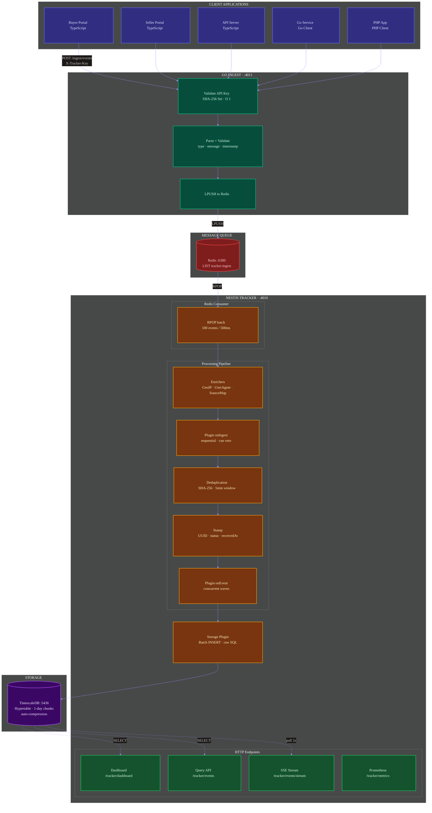
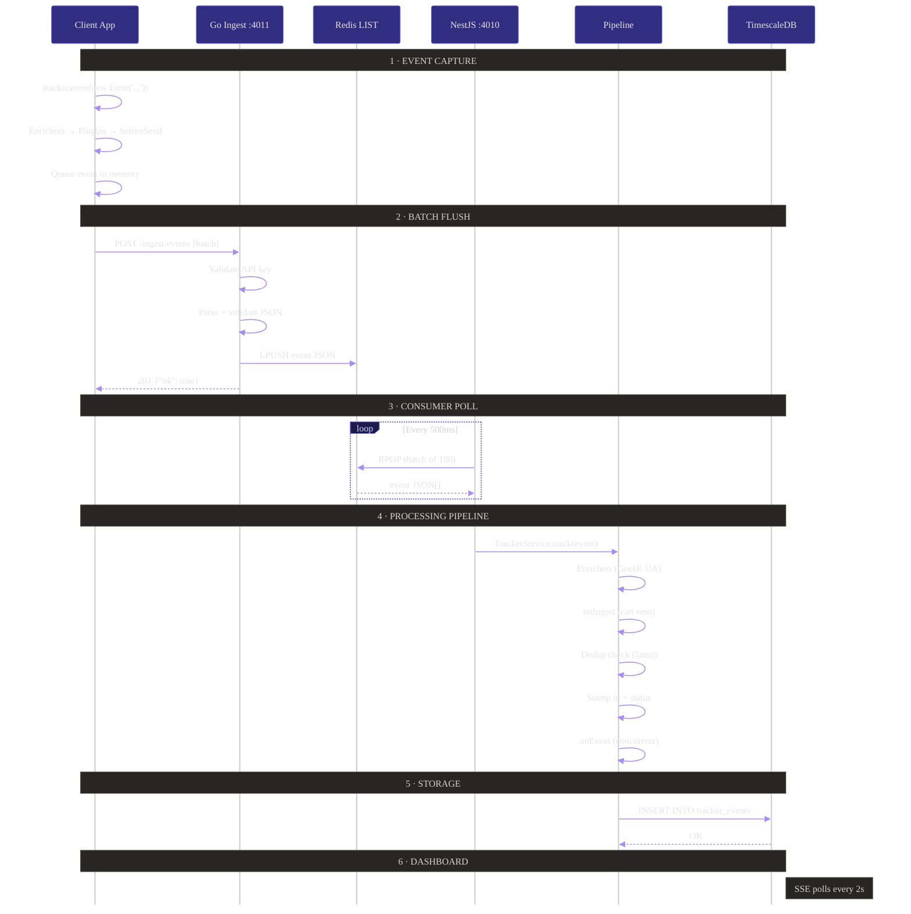
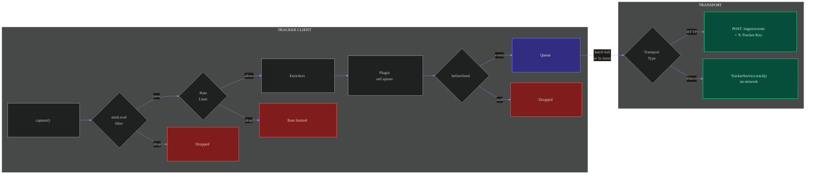
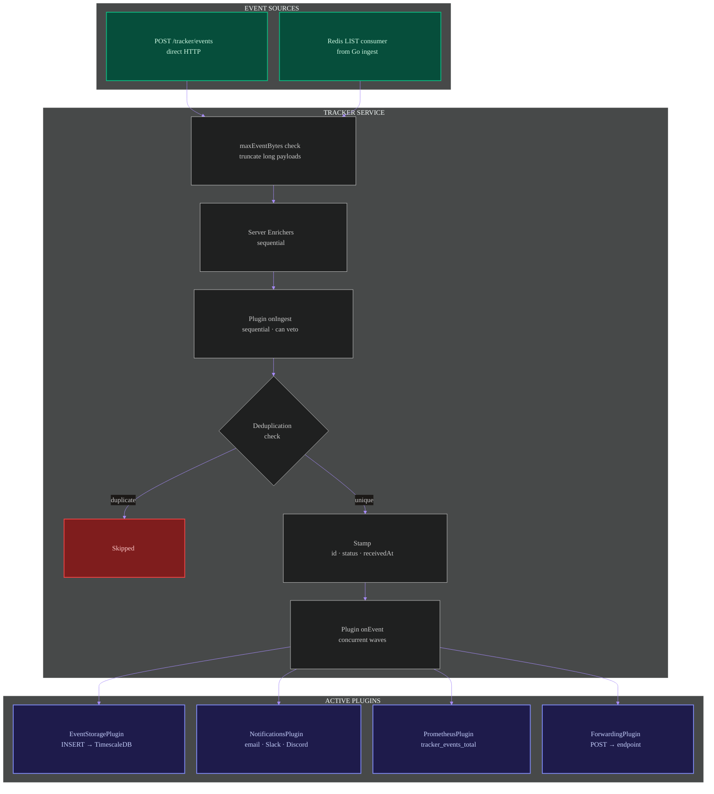
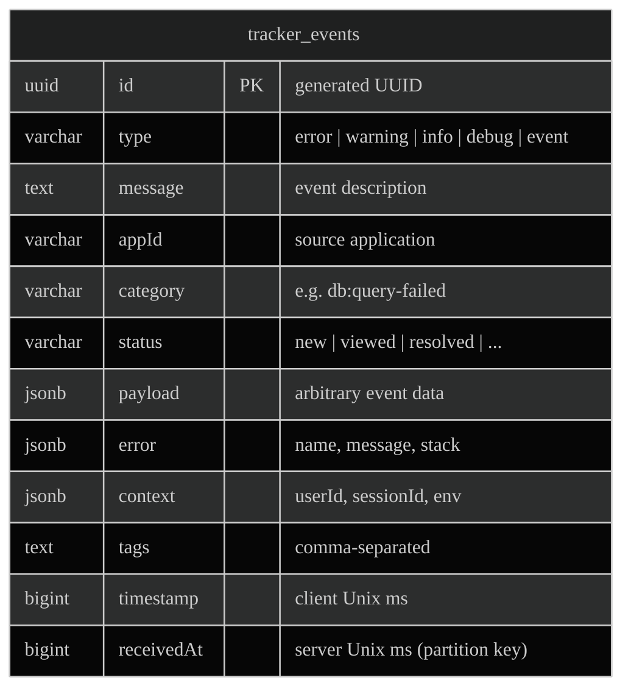
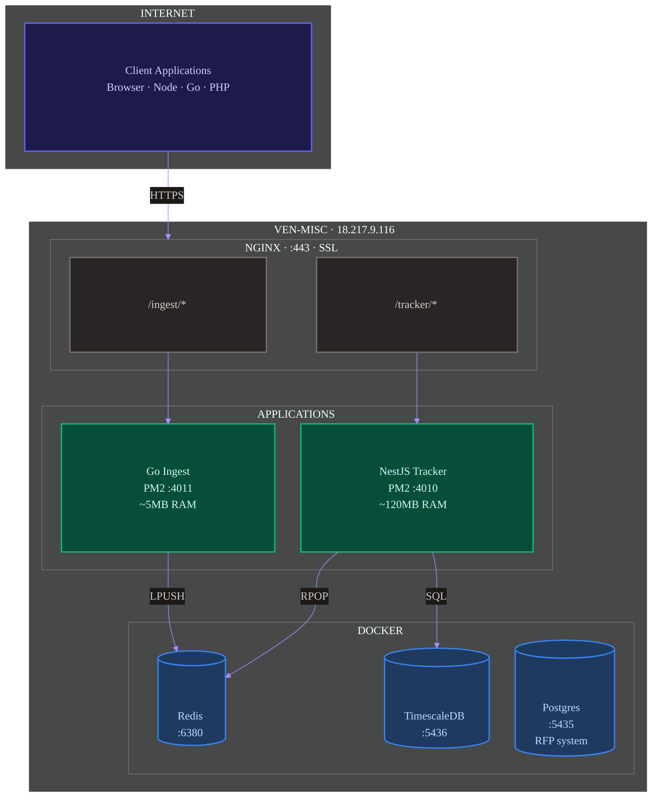

# Tracker Architecture

## System Overview

## Event Lifecycle

## Client-Side Pipeline

## Server-Side Processing

## Database Schema (TimescaleDB)

**Indexes:**

| Type | Columns | Purpose |
|---|---|---|
| B-tree | `type` | Filter by event type |
| B-tree | `appId` | Filter by source app |
| B-tree | `category` | Filter by error category |
| B-tree | `status` | Filter by lifecycle status |
| B-tree | `receivedAt DESC` | Time-range queries |
| B-tree composite | `(appId, type, receivedAt DESC)` | Primary dashboard query |
| GIN jsonb_path_ops | `payload` | Payload field lookups via `@>` |
| GIN jsonb_path_ops | `context` | Context field lookups via `@>` |
| B-tree expression | `context->>'userId'` | User-specific queries |
| B-tree expression | `context->>'environment'` | Environment filtering |
| B-tree expression | `context->>'sessionId'` | Session tracking |
| GIN tsvector | `tags` | Full-text tag search |

**TimescaleDB features:**
- Hypertable partitioned by `receivedAt` (1-day chunks)
- Compression policy: chunks older than 7 days auto-compressed
- Compression segmentby: `appId`, `type`
- Compression orderby: `receivedAt DESC`

## Deployment (ven-misc)

